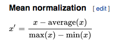

### ANIME Recommender

### Recommender Systems
Recommender Systems are used almost everywhere in daily life. they help us purchase clothes, buy groceries, and find new music. There are many types or recommender Systems we are already familiar with. Spotify recommends new music to users, Netflix recommends new show to watch, and Amazon recommeds a variety of products to user.

 Recommender systems are important because they make decision making easier. When faced with millions of virtual product options online how do we choose which one is best for us? this can be a paralyzing task, One that consumes alot of time and energy. there are two main types of recommender systems

  1. **Content Based Recommender System**
    these recommender look at specific features of products and recommend new products to you based on related features of items you have purchased in the past.

  types include:
    1. Item Content similarity
    2. Classification
    3. Word2Vec

  2. ** Collaborative Based Recommender**
    these recommenders look at a users taste in items and finds users with similar taste. Then recommends a user  items from similar users they haven't rated or purchased.

  types include:
    1. item-item based similarity
    2. user-user based similarity
    3. matrix factorization(PCA, SVG)

  3. ** Popularity Based Recommender**
    a simple recommender that recommends the most popular items to a user.

  i have chosen to focus on a user-user based Collaborative based recommender, but hope to try out all of these in the future.

### Process
the user-user recommender system process:

  1. preprocessing cleaning data, setting threshold values, and normalizing
  2. create pivot matrix and calculate cosine similarity
  3. find similar users to a user
  4. Make recommendations

### DATA
- over 7 million Anime reviews
- 73 thousand unique users
- 6 different Anime types
- over 12 thousand Anime titles

### EDA
the total ratings per movie is very low and skewed right. used to determine movie rating threshold. set a threshold at the mean user rating count of 91.

the user rating count is also skewed right and used to determine user rating threshold. i set a threshold at the upper 25% quartile of 395.

the average anime rating is normally distributed with a mean rating around 7.

### Processing

**Normalization:**
because ratings across user vary so much, i normalized the ratings of each user by applying mean normalization to all users.

**Cosine Similarity:**
used pairwise distance function with cosine set as distance parameter to find users with similar ratings.

** find Most Similar User**
wrote a function to select random user and most similar user. checked similarity between users against Anime ratings dataframe

** find movies user hasn'y seen:**
 i found the movies the user hasn't watched and put them in a dataframe. form here a score would be generated that predict the users rating for the movie and a recommendation would be made, here we can seen the movies are users tastes are similar:

 

**Generate Score:**
this is where i'm currently at in the process. we need to create a function to generate a rating for a user and then recommend a user that movie based on the score.

**the function:**

this is used to predict the rating or how much a user will like a given Anime movie.

### Conclusion

user based collaboration is just one of many methods to generate a recommender system. Once i finalize this method, i plan on evaulating other methods for making recommendations.

### Citations
https://medium.com/sfu-big-data/recommendation-systems-user-based-collaborative-filtering-using-n-nearest-neighbors-bf7361dc24e0

https://en.wikipedia.org/wiki/Feature_scaling
